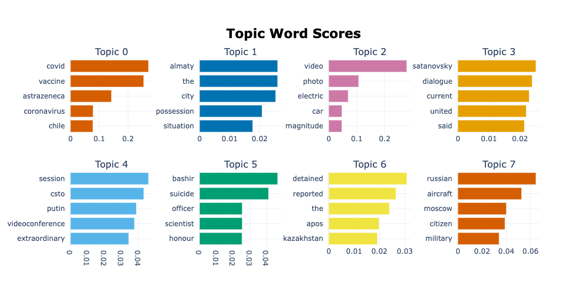
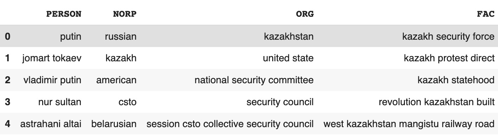

# Omelas_project: Natural Language Processing analysis over 1,500 news articles

The analysis conducted over the articles dataset reveals two main topics present. The first one, corresponds to the political and social unrest in the Republic of Kazakhstan (topics 1 to 7 in the graph below). The second topic is related to Covid-19 and vaccination around the world (topic 0). The tone of the articles is generally neutral, as one would expect from press. However, there is negative sentiment present in both main topics.

<b>Figure 1: Topics and related words</b>

The most common people, places and organizations are related to the Kazakhstan conflict that  began in January 2022 due to increases in gas prices. For example, the most common people in the dataset are Vladimir Putin, president of Russia,  and Jomart Tokayev, president of Kazakhstan. At the same time, the most common Nationalities or Religious or Political Groups (NORP) are Russian, Kazakhstani, and American. Finally, among the most common organizations are the national security committee, the security council and the Collective Security Treaty Organization (CSTO).

<b>Figure 2: Most Common Entities</b>

[^fn1]:Person: people; NORP: nationalities or religious or political groups; ORG: companies, agencies, institutions; FAC: buildings, airports, highways, bridges.

Some key aspects of the conflict:
- The articles highlight the poor intervention of the United States, the military, and peacekeepers intervention. 
- Above all, they highlight Putin’s opinions and Russia’s interventions in the matter. 
- Some of the measures taken by the government of Kazakhstan during the unrest was to resume internet connectivity and flights. 
- Many civilians were killed in the protests. 
- The CSTO of which Russia is a member, was a key player in controlling the protests, and president Tokayev highlighted the collaboration as a success. 

Finally,  most of the articles associated with Covid-19, refer to the suspension of the AstraZeneca vaccine and how cases were increasing in different countries. 

